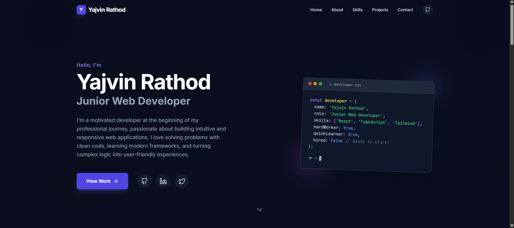

# Interactive Developer Portfolio



> **Note:** A modern, responsive developer portfolio built with React 19 and Tailwind CSS. Features an interactive project gallery that allows users to test applications directly within the portfolio using dynamic modals.

## 🚀 Overview

This project is a single-page personal portfolio designed to showcase web development skills not just through text, but through live interaction. Unlike standard portfolios that just link to external sites, this application integrates full interactive components (like a **Stopwatch** and a **Tic-Tac-Toe** game) directly into the interface.

## ✨ Key Features

*   **Interactive Demos:** Projects can be launched in a modal overlay, running the actual React components live.
*   **Modern UI:** Dark mode aesthetic with "Glassmorphism" effects, animated gradients, and smooth scrolling.
*   **Fully Responsive:** optimized for mobile, tablet, and desktop with a custom mobile drawer navigation.
*   **Type-Safe:** Built completely with TypeScript to ensure reliable data flow for content constants.
*   **Component Architecture:** Clean separation of concerns (Hero, About, Skills, Projects, Contact).

## 🛠️ Tech Stack

*   **Core:** React 19, TypeScript
*   **Styling:** Tailwind CSS (Custom animations, backdrop filters)
*   **Icons:** Lucide React
*   **Deployment:** Vite / Create React App

## 📂 Project Structure

*   `components/`: Reusable UI sections (Hero, Navbar, etc.) and App components (TicTacToe, Stopwatch).
*   `constants.ts`: Centralized data file for easy content updates (Profile, Experience, Skills).
*   `types.ts`: TypeScript interfaces for consistent data structures.

## 🏃‍♂️ How to Run

1.  Clone the repository:
    ```bash
    git clone https://github.com/yourusername/portfolio.git
    ```
2.  Install dependencies:
    ```bash
    npm install
    ```
3.  Start the local server:
    ```bash
    npm start
    ```
